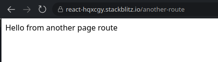
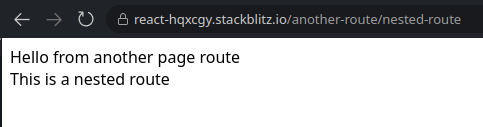
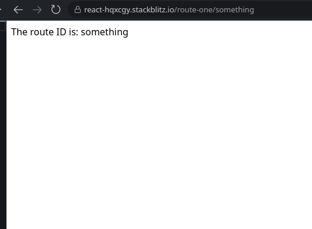
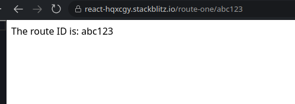
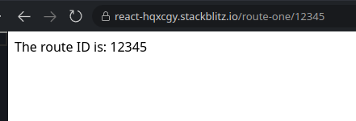
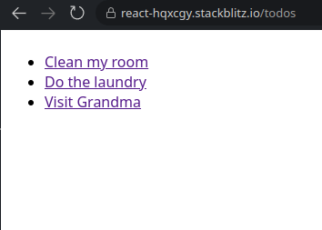
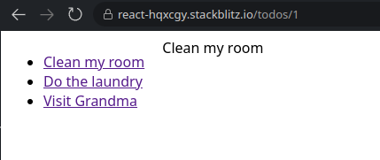

# Routing in React

As we all know, React is a UI library. It's original intent is just to make building UIs so much easier in just Javascript (or Typescript), making components.

There are other libraries that can help with doing other powerful stuff in React. Like creating SPAs, 2D and 3D Games, and many more! For the direction we are going, we are going to focus on SPAs.

## Single-Page Applications (SPAs)

A Single-Page Application is a web application or website that interacts with the user by dynamically rewriting the current web page with new data from the web server, instead of the default method of a web browser loading entire new pages. So instead of us using many different pages to show different types of content, we only use one page to show other types of content.


In Single Page Application, the views are switched out for other views **DIRECTLY** on the same page. So in a regular application, all your pages would live only on one file.

## Library used for Routing in React

The library that is commonly used for creating SPAs is React Router. Let's take a look at React Router and how to use it.

### React Router


React Router is a powerful Routing library used with React. It allows us to create a full on web app using Components.

Let's take a look on how to set up some routing using React Router. (These next instructions assume you created a new project )

#### Installation

Using npm, use the following command: `npm install --save react-router-dom`

#### Setup Routes

In the `main.jsx`, We are going to add the `RouterProvider` and the Routes itself.

First, import the `RouterProvider` and the `createBrowserRouter`.

```jsx
//main.jsx

import React from "react";
import ReactDOM from "react-dom/client";
import { RouterProvider, createBrowserRouter } from "react-router-dom";

//...Rest of the code
```

The `createBrowserRouter` will help us config our routes for the Application. We will add routes and components here so the Router Library knows how to set up and load up components based on the URL.

Let's use the `createBrowserRouter` to set up our routes. We are gonna set up the index route so when we start the Vite server and we go to `http://localhost:5173`, it will show the component we have set for `/`.

The `createBrowserRouter` takes in param of an array of objects. The objects takes a number of properties but for now we will focus on the `path` and `element` property. The `path` property says that when ever we go to this route, we want to show the component. That component we want to show is what is defined in the `element` property.

```jsx
//main.jsx

import React from "react";
import ReactDOM from "react-dom/client";
import { RouterProvider, createBrowserRouter } from "react-router-dom";

const router = createBrowserRouter([
  {
    path: "/",
    element: <div>Hello Index Route</div>,
  },
]);

//...Rest of the code
```

Now that we have defined the router, let's now put it into action by using the `RouterProvider`.

```jsx
//main.jsx

import React from "react";
import ReactDOM from "react-dom/client";
import { RouterProvider, createBrowserRouter } from "react-router-dom";

const router = createBrowserRouter([
  {
    path: "/",
    element: <div>Hello Index Route</div>,
  },
]);

ReactDOM.createRoot(document.getElementById("root")).render(
  <React.StrictMode>
    <RouterProvider router={router} />
  </React.StrictMode>
);
```

So now when we run the app using `npm run dev` and go to `http://localhost:5173`, we should see "Hello Index Route".

When you inspect it further using the developer console, you should see its wrapped by the div.

Now let's another route.

```jsx
//main.jsx

import React from "react";
import ReactDOM from "react-dom/client";
import { RouterProvider, createBrowserRouter } from "react-router-dom";

const router = createBrowserRouter([
  {
    path: "/",
    element: <div>Hello Index Route</div>,
  },
  {
    path: "/another-route",
    element: <div>This is another route</div>,
  },
]);

ReactDOM.createRoot(document.getElementById("root")).render(
  <React.StrictMode>
    <RouterProvider router={router} />
  </React.StrictMode>
);
```

Go to `http://localhost:5173/another-route`, we should see "This is another route".

#### Using function components for pages

Let's say we have some functionality (like state) that is needed to be used in our route. We can use functional components to use in the `element` property. (If you are following along, in your `src` folder, create a `pages` folder, then create a file called `IndexPage.jsx` in the `pages` folder).

For example:

```jsx
// src/pages/IndexPage.jsx
import { useState } from "react";

export default function IndexPage() {
  const [count, setCount] = useState(0);

  return (
    <div className="index-page">
      {" "}
      //For styling
      <div className="counter">
        <button onClick={() => setCount(count + 1)}>Increase</button>
        <div className="actual-count">{count}</div>
        <button onClick={() => setCount(count - 1)}>Decrease</button>
      </div>
    </div>
  );
}

//main.jsx
//Other react imports
import { RouterProvider, createBrowserRouter } from "react-router-dom";
import IndexPage from "./components/IndexPage"; //Import the IndexPage functional component

const router = createBrowserRouter([
  {
    path: "/",
    element: <IndexPage />, //Use the functional component for the element property
  },
  {
    path: "/another-route",
    element: <div>This is another route</div>,
  },
]);

//...Rest of the code
```

When we visit the `/` route from our vite app, we will see this beautiful counter page that we have made. We can also change the `/another-route` element to use a functional component. (Create a page in `src/pages` called `AnotherPage.jsx`).

```jsx
// src/pages/AnotherPage.jsx

export default function AnotherPage() {
  return <div className="another-page">Hello from another page route</div>;
}

// main.jsx
// Other react and react-router-dom imports
import IndexPage from "./pages/IndexPage"; //Import the IndexPage functional component
import AnotherPage from "./pages/AnotherPage";

const router = createBrowserRouter([
  {
    path: "/",
    element: <IndexPage />, //Use the functional component for the element property
  },
  {
    path: "/another-route",
    element: <AnotherPage />,
  },
]);

//...Rest of the code
```

Go to `http://localhost:5173/another-route` and you can see the "Hello from another page route" wrapped in a `div` with a `className` of `another-page`.



#### Creating layouts and nested routes

Still using the setup from earlier, we are going to make another route. Although this route, will have another property attached to it called `children`. So now anything under children, will be a nested route of the parent route.

Let's look at an example:

```jsx
// main.jsx
// Other react,  react-router-dom, and component imports

const router = createBrowserRouter([
  {
    path: "/",
    element: <IndexPage />, //Use the functional component for the element property
  },
  {
    path: "/another-route",
    element: <AnotherPage />,
    children: [
      //children is an array of objects. Each object will contain a path and element property
      {
        path: "nested-route", //When using children, react router will fill in the extra slash in the
        //beginning of the route. So it looks like /another-route/nested-route
        element: <div>This is a nested route</div>,
      },
    ],
  },
]);

//...Rest of the code
```

With this added, we can now run the vite app and go to that route (`http://localhost:5173/another-route/nested-route`), you will see the AnotherPage component but we are expecting to see what is in `/nested-route`. Well there is one other step we have to do before we can see the `/nested-route`. We have to use the `<Outlet />` component. This allows for nested routes to be seen in our parent route.

So let's edit our parent component:

```jsx
// src/pages/AnotherPage.jsx
import { Outlet } from "react-router-dom";

export default function AnotherPage() {
  return (
    <div className="another-page">
      Hello from another page route
      {/*This will allow our router to display the children routes here when active*/}
      <Outlet />
    </div>
  );
}
```

Now you can go to that route in your vite app and see that the "This is a nested route" being displayed in our parent route.



What we can also do with our another page is make it into a layout to use with other children routes.

```jsx
// src/pages/AnotherPage.jsx
import { Outlet } from "react-router-dom";

export default function AnotherPage() {
  return (
    <div className="another-page">
      Hello from another page route
      <div className="layout-in-another-page">
        {/*This will allow our router to display the children routes here when active*/}
        <Outlet />
      </div>
    </div>
  );
}
```

#### Using Dynamic Routes

With routing, we would usually need detail pages. You have probably seen it before. Youtube, Facebook, Instagram, even Twitter have dynamic routes. So that way it's less work to be done when showing certain content over and over. Kind of like when we make reusable functional components.

So instead of creating routes for every user, we would make a dynamic route.

```
/user/1 \
/user/2 - > All these are static routes. You should NOT do this!
/user/3 /

Instead, do this
/user/:userId <- This will basically say whenever we go to /user/3, /user/abc, /user/eyj12i2182mdqi2
                 whatever we type in the url (or click on a link) after /user,
                 we will always land on a page that was defined for /user/:userId
```

What does that look like in code using react router? Let's take a look:

```jsx
//main.jsx
const router = createBrowserRouter([
  {
    path: "/",
    element: <IndexPage />, //Use the functional component for the element property
  },
  {
    path: "/another-route",
    element: <AnotherPage />,
    children: [
      //children is an array of objects. Each object will contain a path and element property
      {
        path: "nested-route",
        element: <div>This is a nested route</div>,
      },
    ],
  },
  {
    path: "/route-one/:routeId",
    element: <PageWithParams />
  }
  //OR
  {
    path: "/route-one",
    children: [
      {
        path: ":routeId",
        element: <PageWithParams />
      }
    ]
  }
]);

//src/pages/PageWithParams.jsx

//import the useParams hook so we can get access to the parameter
import { useParams } from "react-router-dom";

export default function PageWithParams(){
  //Whatever you put after the ":" will be the param name!
  const { routeId } = useParams(); //In this case, its routeId

  console.log(routeId);

  return (
    <div>The route id is: {routeId}</div>
  )
}
```

With this, now anytime we go to `/route-one/<whatever-you-want-here>`, the page will display whatever you typed after the `/route-one/`

Screenshots using different types of params:





Ok now that we know about nested routes and layouts, let's make a simple todo app using routing.

### Todo App example

Requirements:

1. A general Todos page with a route of `/todos`.
2. A Todo detail page that displays the todo. This will be a dynamic route using params

You know what to do...spin up a new Vite app with React! (call it whatever you want)

#### Setting up our routes

Now let's import the `RouterProvider` and the `createBrowserRouter` into the `main.jsx` file.

```jsx
//main.jsx

import React from "react";
import ReactDOM from "react-dom/client";
import { RouterProvider, createBrowserRouter } from "react-router-dom";

const router = createBrowserRouter([
  {
    path: "/todos", //This route is where all of our todos will live
    element: <div>Todo main page</div>, //This page will show when we just go to /todos
    children: [
      {
        //This route will be shown as /todos/123, /todos/abc,
        ///todos/abc123, or /todos/<whatever-you-want-here>
        path: ":todoId",
        //This will show INSIDE the TodosPage component cause we are using the Outlet component
        element: <div>todo detail page</div>,
      },
    ],
  },
]);

ReactDOM.createRoot(document.getElementById("root")).render(
  <React.StrictMode>
    <RouterProvider router={router} />
  </React.StrictMode>
);
```

#### Creating our Todos "Database"

After we have done that, let's make an array of todos and just have that imported. This will act as our "database". (If you are following along on your computer, create a new file in your `src` folder called `todos.js`)

```js
const todos = [
  {
    id: 1, //The id property would be a way to identify a specific todo
    name: "Clean my room",
  },
  {
    id: 2,
    name: "Do the laundry",
  },
  {
    id: 3,
    name: "Visit Grandma",
  },
];

export default todos;
```

#### Creating our Pages

Now that we have todos, let's create pages for the Todos and the Todo Detail pages (If you are following along on your computer, create a new folder in your `src` folder called `pages` then 2 files. One called `TodosPage.jsx` and one called `TodoPage.jsx`).

In the TodosPage, we are going to create a sidebar that list all todos. Then use the `Outlet` component to show the children routes.

```jsx
//src/pages/TodosPage.jsx
import { Outlet } from "react-router-dom";
import todos from "../todos"; //importing all our todos

export default function TodosPage() {
  return (
    <div className="todos-page">
      <div className="todos">
        <ul>
          //Loop through the todos and return a Todo component.
          {todos.map((todo) => (
          {/*We will create this component later. This component will contain the link to each todo.*/}
            <Todo {...todo} /> //
          ))}
        </ul>
      </div>
      <div className="todo-details">
        {/*Outlet shows children routes*/}
        <Outlet />
      </div>
    </div>
  );
}
```

Time to create the Todo Detail page!

```jsx
//src/pages/TodoPage.jsx

//Imports the useParams Hook so we can get the parameter in the URL
import { useParams } from "react-router-dom";
//Import the todos array
import todos from "../todos";

export default function TodoPage() {
  const { todoId } = useParams();

  //Find a todo based on the params in the URL. Params are exposed as strings by default
  //So it's up to you whether you need a stringified param or need a number
  //In this case, we need it as a number so we will parse it using parseInt
  const currentTodo = todos.find((todo) => todo.id === parseInt(todoId));

  //Just return the found todo's name in a div
  return <div>{currentTodo.name}</div>;
}
```

With our TodosPage and the TodoPage pages done, let's quickly build the Todo component. (If you are following along on your computer, create a new folder in your `src` folder called `components` and in the `components` folder, create a file called `Todo.jsx`).

```jsx
//src/components/Todo.jsx

//Import the Link component so we can use react router's way of linking between routes
//in it's own router.
import { Link } from "react-router-dom";

//Using props because we are passing data to this component
//The props being used is id which is a number and name which is a string
export default function Todo(props) {
  return (
    <li>
      <Link to={`/todos/${props.id}`}>{props.name}</Link>
    </li>
  );
}
```

#### Putting everything together

Let's finally put everything together. (If you are following along on your computer, go into the `main.jsx` file in your project) The TodosPage page should be where the `/todos` route is at for the element property. The TodoPage should be where the `:todoId` route is for the element property.

```jsx
//src/main.jsx

//Other React and React Router imports
const router = createBrowserRouter([
  {
    path: "/todos", //This route is where all of our todos will live
    element: <div>Todo main page</div>, //This page will show when we just go to /todos
    children: [
      {
        //This route will be shown as /todos/123, /todos/abc,
        ///todos/abc123, or /todos/<whatever-you-want-here>
        path: ":todoId",
        //This will show INSIDE the TodosPage component cause we are using the Outlet component
        element: <div>todo detail page</div>,
      },
    ],
  },
]);

//Rest of react code
```

#### Don't forget the styling!

Before it's forgotten, here is the CSS code!

```CSS
.todos-page {
  display: flex;
  flex-direction: row;
}

.todos-page > .todos {
  width: 30%;
}
```

#### Final Results

So with everything put together, you should be able to see all the todos on the left side as links. The right side should show the details of the todo.

Should see something like this:





If you notice the URL it shows `/todos` and `/todos/1`.

And that's it! Simple routing with a simple example!
