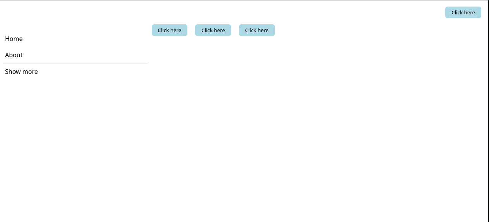

# Intro to Components

## Writing Components

React uses Components to make pieces or whole pages for a User Interface. According to the React Documentation: "Components let you split the UI into independent, reusable pieces, and think about each piece in isolation.".

**When creating components, start them with upper cases** This is cause JSX elements start with lowercase letters, similar to how HTML elements are. When putting in lowercase components, React does not know that it is a component.

There are two types of Components. **Class components** and **Functional Components**.

### Class Components

Before React reached Version 16, Components were written using Classes. So it would look like:

```jsx
import { Component } from "react";

export default class Navbar extends Component {
  render() {
    return (
      <div className="navbar">
        <ul className="navbar-list">
          <li className="navbar-item">Home</li>
          <li className="navbar-item">About</li>
          <li className="navbar-item divider"></li>
          <li className="navbar-item">Login</li>
        </ul>
      </div>
    );
  }
}

<Navbar />;
```

As a class component became bigger in functionality and/or JSX elements, it became much more difficult to read and understand. So react did a refactor and allowed developers to make Functional components.
With that, components can be broken down even more AND reading them becomes so much easier.

Class Component:

```jsx
export default class Navbar extends Component {
  render() {
    return (
      <div className="navbar">
        <ul className="navbar-list">
          <li className="navbar-item">Home</li>
          <li className="navbar-item">About</li>
          <li className="navbar-item divider"></li>
          <li className="navbar-item">Login</li>
        </ul>
      </div>
    );
  }
}
```

Functional Component:

```jsx
//Regular function
function Navbar() {
  return (
    <div className="navbar">
      <ul className="navbar-list">
        <li className="navbar-item">Home</li>
        <li className="navbar-item">About</li>
        <li className="navbar-item divider"></li>
        <li className="navbar-item">Login</li>
      </ul>
    </div>
  );
}

//or

//Arrow function with explicit return
const Navbar = () => {
  return (
    <div className="navbar">
      <ul className="navbar-list">
        <li className="navbar-item">Home</li>
        <li className="navbar-item">About</li>
        <li className="navbar-item divider"></li>
        <li className="navbar-item">Login</li>
      </ul>
    </div>
  );
};

//or

//Arrow function with implicit return
//Should only use implicit returns when you only need to return the JSX
const Navbar = () => (
  <div className="navbar">
    <ul className="navbar-list">
      <li className="navbar-item">Home</li>
      <li className="navbar-item">About</li>
      <li className="navbar-item divider"></li>
      <li className="navbar-item">Login</li>
    </ul>
  </div>
);
```

Again notice that the boilerplate code for setting up a component using functions is very very minimal compared to a class component

## Using components together

So lets say we have a Page we want to put together. These are the rquirements our page needs to meet:

- It consists of a sidebar, a navbar, and multiple buttons.
- In the navbar, it has a single button on the right in the navbar.
- Now the button needs to remain the same in the UI. No changes to the styles.

(if you are following along, you may want to spin up your own project using Vite. This is all being written into the `App.tsx` file. Also the classes will be provided towards the end)

1. Let's write it out together. First let's write our button component.

```jsx
//Again the name of your components can be whatever name you want it to be!
function MyCoolButton() {
  return <button className="my-cool-button">Click here</button>;
}
```

2. Now we have our button, let's write out the Navbar component (going to use the same code from above)

```jsx
function Navbar() {
  return (
    <div className="navbar">
      <ul className="navbar-list">
        <li className="navbar-item">
          <MyCoolButton />
        </li>
      </ul>
    </div>
  );
}
```

3. Now to create the sidebar component

```jsx
function Sidebar() {
  return (
    <div className="sidebar">
      <ul className="sidebar-list">
        <li className="sidebar-item">Home</li>
        <li className="sidebar-item">About</li>
        <li className="sidebar-item divider"></li>
        <li className="sidebar-item">Login</li>
      </ul>
    </div>
  );
}
```

4. Now lets put it all together!

```jsx
function App() {
  return (
    <div className="app">
      <Navbar /> //Our custom Navbar component
      <div className="page-content">
        <Sidebar /> //Our custom Sidebar component
        <div className="content">
          //Our cool button component being used so many times
          <MyCoolButton />
          <MyCoolButton />
          <MyCoolButton />
        </div>
      </div>
    </div>
  );
}
```

Styles (paste into your `App.css`. Make sure your `index.css` is empty so not styles get overlapped):

```css
div.sidebar {
  width: 30%;
}

div.sidebar > ul.sidebar-list,
div.navbar > ul.navbar-list {
  list-style: none;
  padding: 0;
}

div.navbar > ul.navbar-list {
  display: flex;
  justify-content: end;
}

div.sidebar > ul.sidebar-list > li.sidebar-item {
  padding: 10px 0 10px 5px;
}

div.sidebar > ul.sidebar-list > li.divider {
  width: 100%;
  border-bottom: solid 1px lightgray;
}

div.navbar > ul.navbar-list > li.navbar-item {
  margin: 10px 0 10px 5px;
}

div.page-content {
  display: flex;
  justify-content: baseline;
}

button.my-cool-button {
  background-color: lightblue;
  border: solid 1px transparent;
  border-radius: 6px;
  margin: 0 10px;
  padding: 5px 15px;
}
```

With everything built out, your page should look something like this:


So now we have made a simple Home Page using React and Components!

[ React Documentation regarding Components ](https://reactjs.org/docs/components-and-props.html#rendering-a-component)

Next let's talk about [Props](03-props.md)!
