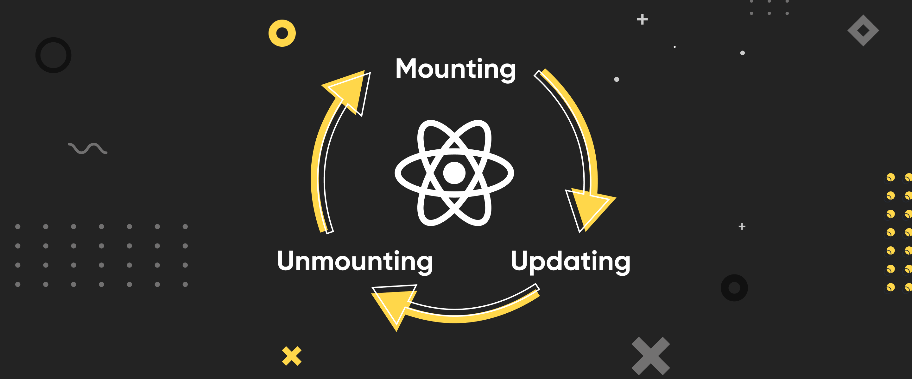

# State and Lifecycle

## State

### What is state in a React Component?

"State of a component is an object that holds some information that may change over the lifetime of the component" (source: [GeekForGeeks React State](https://www.geeksforgeeks.org/reactjs-state-react/)). State is a way to make sure that data stays the same unless we **EXPLICITLY** change it. State by default is immutable (cannot change directly). State can be different data types not functions though. You can use a function to set the inital state.

Example (**Disregard the Hook. It will be explained later**) with keeping a counter:

```jsx
//Need to import the useState hook inorder to create and maintain a state in a component
import { useState } from "react";

function Counter() {
  // Creating a count state.
  // We destructure the array from useState.
  // We could do count[0] which would be the value of the state
  // and count[1] for the helper function to mutate state.
  // The useState hook provides the actual state for reading the value or manipulating it if needed
  // and a helper function for mutating the state.
  const [count, setCount] = useState(0);

  // This function uses the helper function to increase the count state
  const increase = () => {
    setCount((num) => num + 1); //
  };

  // This function uses the helper function to decrease the count state
  const decrease = () => {
    setCount((num) => num - 1);
  };

  return (
    <div style={{ display: "flex" }}>
      {/* using the onClick event */}
      <button onClick={() => increase()}>+</button>
      <span>{count}</span>
      <button onClick={() => decrease()}>-</button>
    </div>
  );
}
```

In the above code, the count will always be there. No matter how you increase or decrease, the count will always be there and contain either a new value or the same value (depending if you used the helper function or not). Even if React performs a rerender (Please look at the lifecycle section to understand [rerenders](#lifecycle)). **State will always be constant in the component you use it in. When mutating state, the React will perform a rerender of the component (Hence the name, React...it's a pun. I hope you got it)**

Now what if we wanted to create a form and perserve the username and password then check if they are good credentials. We could use state to keep data consistent. **State can be whatever shape you give it. It can be a string, boolean, array, object, or a number.**

Example:

```jsx
//Don't forget to import the useState hook
import { useState } from "react";

function LoginForm() {
  //Username state
  const [username, setUsername] = useState(""); //Setting the state as an empty string
  //Password state
  const [password, setPassword] = useState(""); //Setting the state as an empty string

  const submitLoginForm = (event) => {
    event.preventDefault(); //Prevents the default behavior of form submission

    //If the username state is equal to "user123" AND
    //password state is equal to "pass123"
    //Then the login is good.
    if (username == "user123" && password == "pass123") {
      console.log("User checks out");
    } else {
      console.log("User does not check out");
    }
  };

  //Using the onSubmit event
  return (
    <form onSubmit={(e) => submitLoginForm(e)} className="login-form">
      {/* For the inputs, we are setting each value into their respective states*/}

      {/* If you type into the username input, the value gets sent to the username state*/}
      <input
        name="username"
        onChange={(event) => setUsername(event.target.value)}
      />

      {/* If you type into the username input, the value gets sent to the username state*/}
      <input
        name="password"
        onChange={(event) => setPassword(event.target.value)}
      />
    </form>
  );
}

function App() {
  return (
    <div>
      <LoginForm />
    </div>
  );
}
```

## Lifecycle

In React, a component has a lifecycle that it goes through. The lifecycle looks like:


1. **Mounting**: This lifecycle method means the component has been loaded, is mounted onto the VDOM, and the user can now see said component. In the old react way, here you would be able to perform data fetching. Now you would just subscribe to data or add an event listener.
2. **Updating**: This method occurs when either a prop and/or a state of a component has changed. The component that is being updated performs a **_Rerender_**. Rerenders are when a component's code needs to be re-run and display new data that has been changed. For example, when a state of a component has been changed, the component NEEDS to be rerendered so we can see the new state value in the component. As a code example, the Counter component above is a good example. Every time we increaase or decrease the count, a rerender happens so we can see the new state value.
3. **Unmounting**: This lifecycle method occurs when a component is being removed from the VDOM and the user's view. Cleanup code can be performed at this method. So if your component is listening or subscribed to something, make sure you make it unlisten or unsubscribe. If you don't unsubscribe or unlisten to an event then each time your component is mounted, it's going to subscribe AGAIN or add another event listener on top of what is already listening which can lead to having memory leaks (Memory Leaks == **No Bueno**).

These 3 Lifecycles are Very VERY important to understand how your component works and lives when being used. There are other stuff that also happen underneath the hood but we are not jumnping into that as much.

Next we will be taking a dive into [Hooks](06-hooks.md). It will go into more of how to use hooks, the different types of hooks, and how to make our own hook (making a simple API call).
