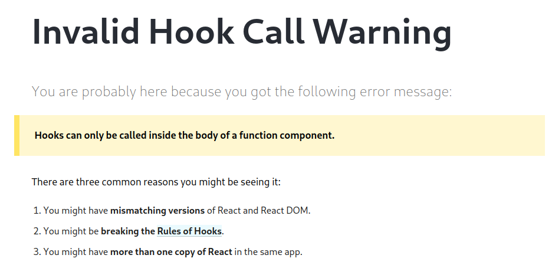
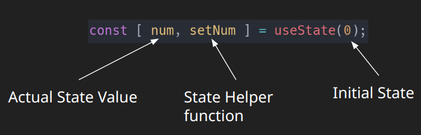
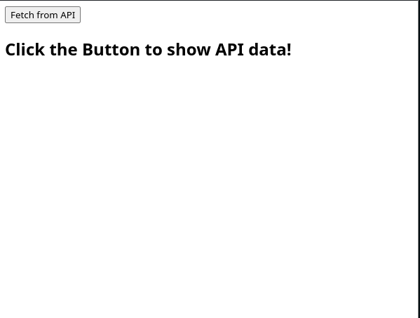
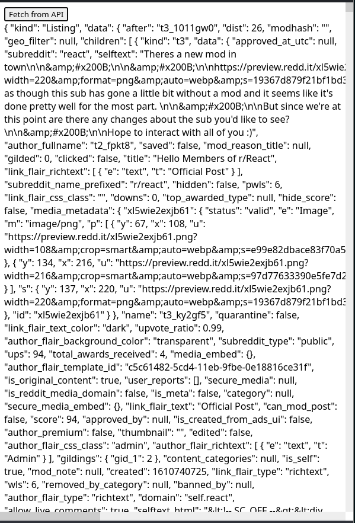

# React Hooks

## What are React Hooks?

React Hooks are in-built functions that allow React developers to use state and lifecycle methods inside functional components. After the React Core team realized that Class components just weren't the way to go, they decided to rewrite up the way components were being written and used functions but with functions, we wouldn't be able to access certain lifecycle methods like `componentDidMount`, `componentDidUpdate`, `componentDidUnmount`. (Please refer back to [State and Lifecyle: Lifecycle section](05-state-and-lifecycle#lifecycle) if you are confused on these methods) or state. So they came up with Hooks!

Hooks can **ONLY** be used in React Functional components. If you try to use a hook outside of a react component, an error will be thrown that looks like:


### Rules of Hooks

1. Only call hooks at the top of your Functional Component.
   Examples:

```jsx
function ExampleComponent() {
  const clickButton = () => {
    //❌ Bad
    // The hook is being called in a function when it should be called top level
    const [state, changeState] = useState("");
  };

  return (
    <button onClick={() => clickButton()}>Click here to make a state</button>
  );
}
```

```jsx
function ExampleComponent() {
  //✅ Good
  //This hook is being called at the top level
  //Before any other functions
  const [state, changeState] = useState("");

  return (
    <button onClick={() => changeState("Hello world")}>
      Click here to change state
    </button>
  );
}
```

```jsx
function ExampleComponent() {
  //✅ Good
  //These hooks are being called at the top level
  // You can call on as many hooks as you need!
  const [state1, changeState1] = useState("");
  const [state2, changeState2] = useState("");
  const [state3, changeState3] = useState("");

  return (
    <div>
      <button onClick={() => changeState1("Hello world")}>
        Click here to change state
      </button>
      <input name="state2" onChange={(e) => changeState2(e.target.value)} />
    </div>
  );
}
```

2. When creating your own hook, other hooks must be used (1 or more hooks). Those hooks must be used at the top level of your custom hook.
   Example:

```jsx
function useWindowWidth() {
  //Custom Hooks usually start with 'use'
  // ✅ Good: top-level in a custom Hook
  const [width, setWidth] = useState(window.innerWidth);
  // ...
}
```

3. Hooks must not be called from nested code (e.g., loops, conditions)
   Examples:

```jsx
function ExampleComponent() {
  // ❌ Bad
  //Hooks should not be utilized conditionally. The hook should either be used or not at all
  if (value) {
    useEffect(() => {
      //This is another react hook called useEffect
      //Do something here
    }, []);
  } else {
    const [state2, changeState2] = useState(false);
  }

  return <div></div>;
}
```

```jsx
function ExampleComponent() {
  // ✅ Good
  //These hooks are being utilized regardless if they are needed or not.
  //Again, if you don't really need a hook, just remove it.
  const [state2, changeState2] = useState(false);

  useEffect(() => {
    //This is another react hook called useEffect
    //Do something here
  }, []);

  return <div></div>;
}
```

## Different Types of Hooks

### `useState`

`useState` enables you to add state to function components. Calling useState inside a function component generates a single piece of state associated with that component.

State of a component is an object that holds some information that may change over the lifetime (componentDidMount, componentDidUpdate, componentDidUnmount) of the component.

**DO NOT MUTATE STATE DIRECTLY**. Use the helper function provided to mutate state. After state has been changed using the helper function, A [ rerender ](05-state-and-lifecycle.md#lifecycle) will occur.



Example of `useState`:

```jsx
//Need to import the useState hook inorder to create and maintain a state in a component
import { useState } from "react";

function Counter() {
  // Creating a count state.
  // We destructure the array from useState.
  // We could do count[0] which would be the value of the state
  // and count[1] for the helper function to mutate state.
  // The useState hook provides the actual state for reading the value or manipulating it if needed
  // and a helper function for mutating the state.
  const [count, setCount] = useState(0);

  // This function uses the helper function to increase the count state
  const increase = () => {
    setCount((num) => num + 1); //
  };

  // This function uses the helper function to decrease the count state
  const decrease = () => {
    setCount((num) => num - 1);
  };

  return (
    <div style={{ display: "flex" }}>
      {/* using the onClick event */}
      <button onClick={() => increase()}>+</button>
      <span>{count}</span>
      <button onClick={() => decrease()}>-</button>
    </div>
  );
}
```

### `useEffect`

`useEffect` is what we can use to simulate how the lifecycle of a Component works.

- Can do componentDidMount, componentDidUpdate, componentDidUnmount
- Do not consider the useEffect hook to be the lifecycle hook. It is not a replacement for how the old events worked (componentDidMount, componentDidUpdate, componentDidUnmount).

useEffect is meant to check if certain items have changed, just runs a function when a component has been mounted, and/or when a component has been unmounted, it would run a function supplied.

Example:

```jsx
//Need to import useEffect from react inorder to use it in a component
import { useEffect } from "react";

// Function component just running when the component is mounted (The component is visible to the user)
function ComponentWithUseEffect() {
  useEffect(() => {
    console.log("I, the component, has been mounted");
  }, []); //This is a dependency array. With 0 dependencies, this function will only run once

  return <div>I am the component that has been mounted</div>;
}
```

```jsx
//DO NOT FORGET TO IMPORT!
import { useState, useEffect } from "react";

// Function component just running when the component is mounted AND any of the dependencies have been changed.
function ComponentWithUseEffect() {
  const [count, setCount] = useState(0);

  useEffect(() => {
    console.log("I, the component, has been mounted...and possibly updated");
  }, [count]); //This is a dependency array. With 1 dependency, this function will run everytime that dependency has changed

  return (
    <button onClick={() => setCount((prevCount) => prevCount + 1)}>
      Click me already, so I can print a message
    </button>
  );
}
```

```jsx
import { useState, useEffect } from "react";

// You can also use multiple useEffects if needed to split up responsibilites.
function ComponentWithUseEffect() {
  const [count, setCount] = useState(0);

  useEffect(() => {
    console.log("I, the component, have been mounted");
  }, []);

  useEffect(() => {
    console.log("I, the component, has updated");
  }, [count]); //This is a dependency array. With 1 dependency, this function will run everytime that dependency has changed

  return (
    <button onClick={() => setCount((prevCount) => prevCount + 1)}>
      Click me already, so I can print a message
    </button>
  );
}
```

My reasoning for why I don't consider useEffect to not be a lifecycle hook (click on the video below):
[](https://www.youtube.com/watch?v=HPoC-k7Rxwo)

### `useRef`

`useRef` is a React Hook that creates mutable persistent data in functional components. _`useRef` does not cause rerenders when its data is mutated._ `useRef` is mostly used for accessing DOM elements directly.

Example with Simple Count:

```jsx
//Have to import useRef!
import { useRef } from "react";

function ComponentWithUseRef() {
  //Refs create and return an object with the current key and a value
  // The value being what you set as the initial value or changed to
  // So in this case, count would look like { current: 0 }
  const count = useRef(0);

  const increase = () => {
    //With one click, the count would look like
    //{ current: 1 }
    count.current = count.current + 1;
  };

  //Each time we click, the count DOES increase BUT does not cause a rerender
  //So the way it's currently displayed, it will always show 0 until a rerender has been triggered
  return <button onClick={() => increase()}>{count.current}</button>;
}
```

Example with accessing a DOM element directly:

```jsx
import { useRef } from "react";

function ComponentWithUseRef() {
  const elementRef = useRef(); //Make sure the ref does not have an initial value

  useEffect(() => {
    //Shows the actual element.
    //Now we can perform some dom manipulation like document.addEventListener or something else
    console.log(elementRef.current);
  }, []);

  //Here we supply the elementRef into the div via it's ref prop.
  //Now we would have access to this DOM element directly
  return <div ref={elementRef}>I am Element</div>;
}
```

With Hooks now in our arsenal, let's create our own and take a look at some third party hooks!

## Custom Hooks

### Custom API Hook

Let's make our own hook that will call an API. The requirements are:

- The hook accepts an API URL as a param
- A loading state set to a boolean (`true` or `false`)
- A toggling state (to say that we can call the API) set to a boolean (`true` or `false`)
- An error state (if something goes wrong, we want the dev or anyone else to know that something went wrong when calling the API) set to a boolean (`true` or `false`).
- Data state. This will contain the data from the API and make it consistent in a component. Set it to null cause the data should be empty until we actually get something.

With the requirements known, let's jump into it. (If you are following along, We are assuming you are using a Vite React Project)

Let's start with making the custom hook with the param. It should look like a regular function. Call it `useAPI`.

```jsx
const useAPI = (url) => {};
```

Next let's add our states. Remember, we need a loading, error, toggling, and data states. So we will use another hook to help us manage states. That hook being the `useState` hook.

```jsx
import { useState } from "react"; //Import the useState hook

const useAPI = (url) => {
  const [isLoading, setLoading] = useState(true);
  const [isError, setError] = useState(false);
  const [data, setData] = useState(null);
  const [shouldFetch, setFetch] = useState(false);
};
```

Now that we have our states, let's make the call to an API and make sure it's only called when our `shouldFetch` state is set to true and something in the url has changed (maybe the user wants to call another api). For this, we will use the `useEffect` hook. Remember the `useEffect` hook can run functions when something in it's dependency array has changed. In this case, we will check if our `shouldFetch` state has changed.

```jsx
import { useState, useEffect } from "react"; //Import the useEffect hook

const useAPI = (url) => {
  const [isLoading, setLoading] = useState(true);
  const [isError, setError] = useState(false);
  const [data, setData] = useState(null);
  const [shouldFetch, setFetch] = useState(false);

  useEffect(() => {}, [url, shouldFetch]); //Now listening to see if the URL and/or shouldFetch state has changed.
};
```

Next let's create a function that does the actual fetch from the API. For this example, we will be using the [ `fetch` ](https://developer.mozilla.org/en-US/docs/Web/API/Fetch_API/Using_Fetch) function that is available in most Node.js runtimes. We will call the function `fetchFromAPI`.

```jsx
import { useState, useEffect } from "react";

const useAPI = (url) => {
  const [isLoading, setLoading] = useState(true);
  const [isError, setError] = useState(false);
  const [data, setData] = useState(null);
  const [shouldFetch, setFetch] = useState(false);

  useEffect(() => {
    //We will use an async/await function to run promises.
    const fetchFromAPI = async () => {
      try {
        //Wait for the fetch function to finish running then continue running the rest of the code.
        const apiData = await fetch(url).then((data) => data.json());

        //Change the loading state to false. By default the loading state is set to true.
        //This tells the user that the hook has finished fetching from the API.
        setLoading(false);

        //Any data that has been returned from the fetch is now put into our data state
        setData(apiData);

        //Now we make sure that the user can not fetched until this state is set to true again.
        setFetch(false);
      } catch (e) {
        //If there was an error, we want to set the loading state to false
        //to tell the user the fetching has been done.
        setLoading(false);

        //Set the error state to true to tell the user that there was an error.
        //we are not telling the user what the error is, just that there was an error
        setError(true);
      }
    };
  }, [url, shouldFetch]);
};
```

After the function has been made, we want to make sure that it can only be called **_IF_** the shouldFetch function is set to true.

```jsx
import { useState, useEffect } from "react";

const useAPI = (url) => {
  const [isLoading, setLoading] = useState(true);
  const [isError, setError] = useState(false);
  const [data, setData] = useState(null);
  const [shouldFetch, setFetch] = useState(false);

  useEffect(() => {
    //By default, the useEffect function CANNOT be a promise, it can contain promises.
    const fetchFromAPI = async () => {
      try {
        const apiData = await fetch(url).then((data) => data.json());

        setLoading(false);

        setData(apiData);

        setFetch(false);
      } catch (e) {
        setLoading(false);

        setError(true);
      }
    };

    if (shouldFetch) {
      //runs if shouldFetch is equal to true
      //runs the fetchFromAPI function
      //Notice that we didn't use an async/await
      //useEffect knows how to run any promise in the function.
      fetchFromAPI();
    }
  }, [url, shouldFetch]);
};
```

With this, let's make sure we can return these states so the component that is using this hook, can use the data.

```jsx
import { useState, useEffect } from "react";

const useAPI = (url) => {
  const [isLoading, setLoading] = useState(true);
  const [isError, setError] = useState(false);
  const [data, setData] = useState(null);
  const [shouldFetch, setFetch] = useState(false);

  useEffect(() => {
    //By default, the useEffect function CANNOT be a promise, it can contain promises.
    const fetchFromAPI = async () => {
      try {
        const apiData = await fetch(url).then((data) => data.json());

        setLoading(false);

        setData(apiData);

        setFetch(false);
      } catch (e) {
        setLoading(false);

        setError(true);
      }
    };

    if (shouldFetch) {
      //runs if shouldFetch is equal to true
      //runs the fetchFromAPI function
      //Notice that we didn't use an async/await
      //useEffect knows how to run any promise in the function.
      fetchFromAPI();
    }
  }, [url, shouldFetch]);

  return {
    data,
    isLoading,
    isError,
    setFetch,
  };
};
```

Let's now use our custom hook in a component and see what it looks like using it. (Again this assumes you are inside a Vite react project);

```jsx
import { useState, useEffect } from "react";

const useAPI = (url) => {
  const [isLoading, setLoading] = useState(true);
  const [isError, setError] = useState(false);
  const [data, setData] = useState(null);
  const [shouldFetch, setFetch] = useState(false);

  useEffect(() => {
    //By default, the useEffect function CANNOT be a promise, it can contain promises.
    const fetchFromAPI = async () => {
      try {
        const apiData = await fetch(url).then((data) => data.json());

        setLoading(false);

        setData(apiData);

        setFetch(false);
      } catch (e) {
        setLoading(false);

        setError(true);
      }
    };

    if (shouldFetch) {
      //runs if shouldFetch is equal to true
      //runs the fetchFromAPI function
      //Notice that we didn't use an async/await
      //useEffect knows how to run any promise in the function.
      fetchFromAPI();
    }
  }, [url, shouldFetch]);

  return {
    data,
    isLoading,
    isError,
    //Setting toggleFetch as a function and returning it
    toggleFetch: () => setFetch(true),
  };
};

function App() {
  //By default:
  //  isLoading is true. So always loading
  //  isError is false.
  //  data is null
  //  toggleFetch is just a function
  const { isLoading, isError, data, toggleFetch } = useAPI(
    "https://www.reddit.com/r/react.json"
  );

  return (
    <div>
      {/* Once we click the button, we are able to trigger an API call*/}
      <button onClick={() => toggleFetch()}>Fetch from API</button>
      {/* 
        We have a big conditional set before displaying data. 
        Checks for the isLoading state is equal to false AND 
        the isError state is equal to false (which basically means there are no errors) AND
        the data state is NOT equal to null

        if the conditional is true overall, then the data would be displayed

        if not, there is a header that is displayed instead
      */}
      {isLoading === false && isError === false && data !== null ? (
        <div>{JSON.stringify(data, null, 2)}</div>
      ) : (
        <h2>Click the Button to show API data!</h2>
      )}
    </div>
  );
}
```

We now have a full on custom API hook that shows data! Here are the images with the final results of using the hook:

### Before API Hook is called



### After API Hook is called via the button



## Third Party Hooks

The best part about the React community is that if you are thinking of creating a component or hook from Scratch, well you shouldn't. 99% of the time, a team or someone has already developed the component or Hook you are thinking of making.

For instance, fetching data from an API. There are numerous hooks that can help fetch data from an API.

- [ useSWR ](https://swr.vercel.app/)
- [React Query (now known as Tanstack Query)](https://tanstack.com/query/v4)
- In the latest Experimental React version, There is a new builtin hook called [`use`](https://github.com/acdlite/rfcs/blob/first-class-promises/text/0000-first-class-support-for-promises.md#example-use-in-client-components-and-hooks). **IT IS NOT MEANT FOR CURRENT DEVELOPMENT. IT IS STILL SUPER EARLY**
- And So much more.

You can easily go into any search engine you are using and just search for the hook or component you are trying to make and again 99% of the time, a team or someone has already made that hook or component you are trying to make.

Now with Hooks done, let's move onto some more advanced topics. Like Routing. **Let's make a SPA!**
